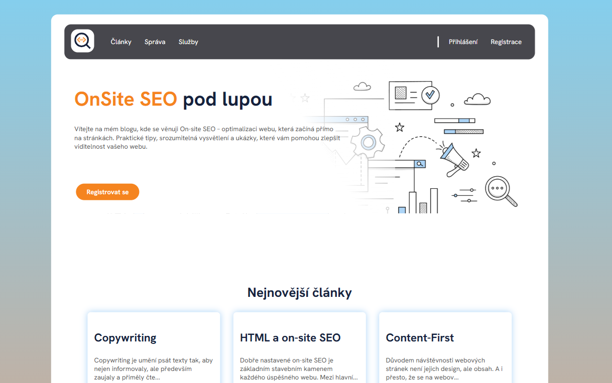
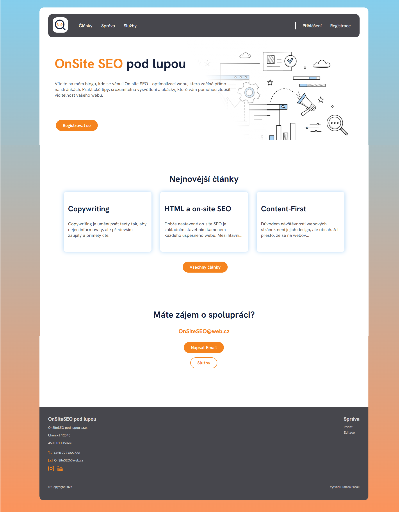
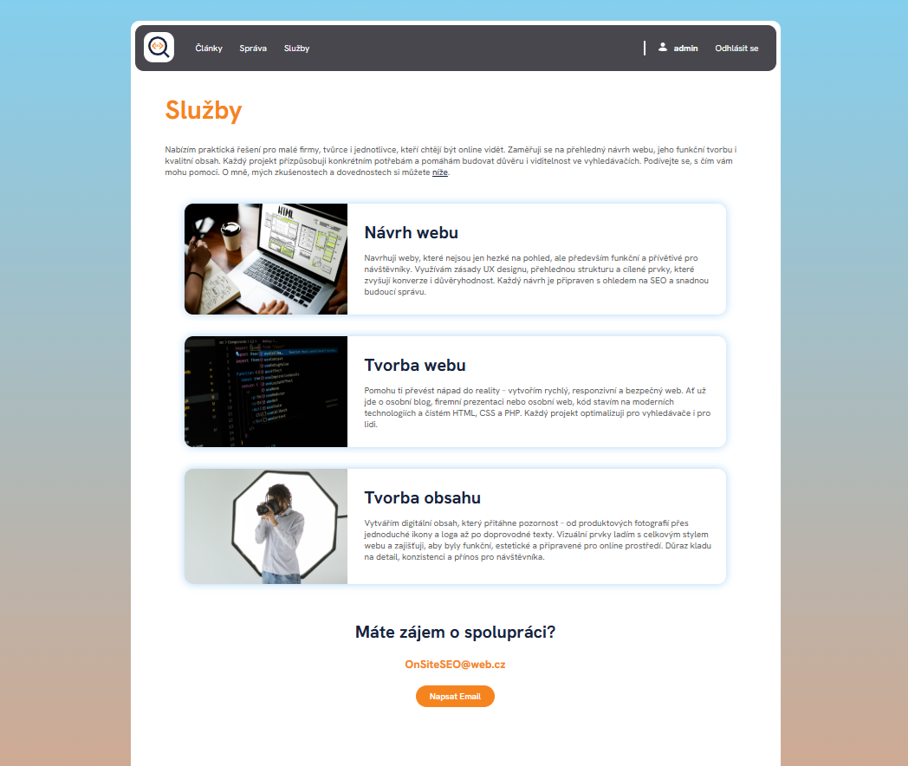
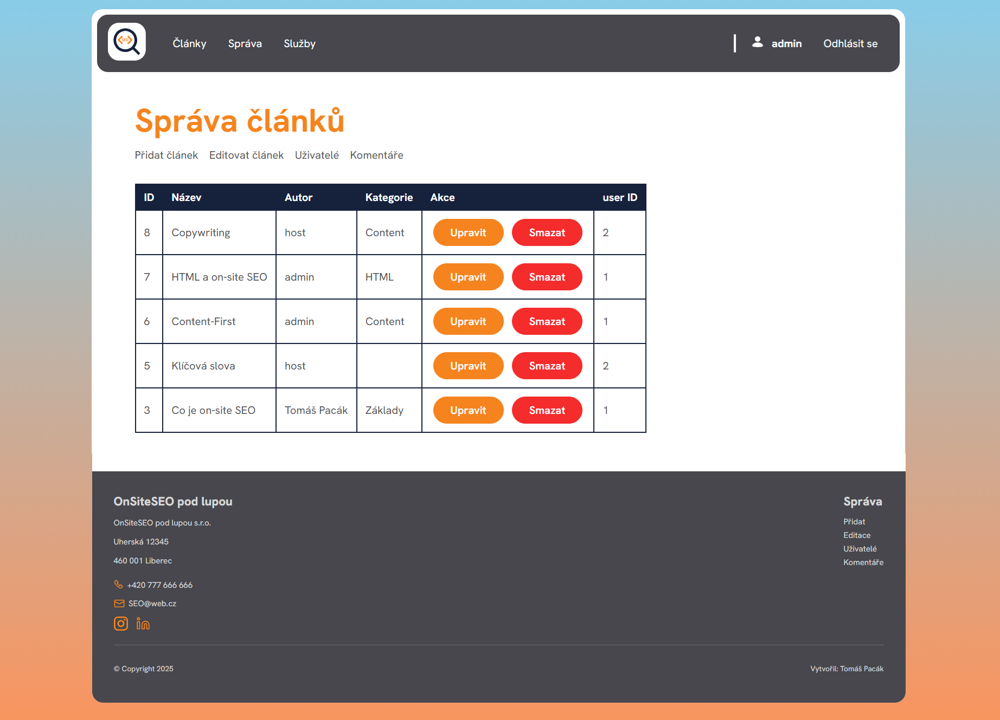
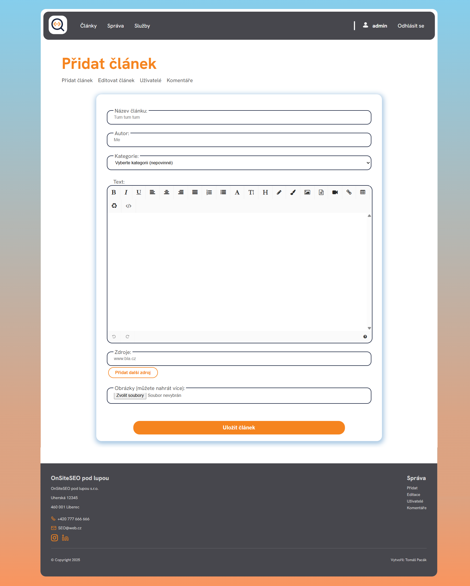

# On-site SEO pod lupou

Plně responzivní blogový systém vyvinutý od nuly s využitím vlastního MVC frameworku. Projekt slouží jako ukázka mých full-stack dovedností v oblasti **PHP, MySQL, HTML, CSS, JavaScriptu a UI/UX**.

> 🛠️ **Simulace reálného CMS prostředí:** od návrhu databáze přes vývoj backendu a frontend rozhraní až po správu obsahu, uživatelů a oprávnění.

---

## Proč tento projekt?

-  **Full-stack zkušenosti** - od návrhu databáze přes backend logiku až po frontend UX/UI
-  **Bezpečnost** - ochrana proti XSS a SQL injection
-  **Vlastní CMS architektura**: Administrace obsahu bez použití externích frameworků
-  **Vlastní návrh designu**: mobil-first a content-first přístup, ručně psané CSS
-  **Reálný obsah**

---
## Obsah
- [Úvod](#on-site-seo-pod-lupou)
- [Funkce](#funkce)
  * [Admin rozhraní](#admin-rozhran-)
  * [Uživatelská rozhraní](#u-ivatelsk--rozhran-)
- [Náhled webu](#nahled-webu)
- [Implementační detaily](#implementační-detaily)
- [Použité technologie](#použité-technologie)
- [Jak spustit projekt](#jak-spustit-projekt)
---

## Funkce

### Admin rozhraní

- **Přidávání článků** - Integrovaný WYSIWYG editor umožňuje snadnou správu článků včetně zdrojování a  formátování obsahu.
- **Editace a mazání článků**
- **Správa uživatelů** - změna rolí, mazání účtů
- **Správa komentářů**

### Uživatelská rozhraní

-  **Registrace / přihlášení**
-  **3 nejnovější články** - vždy dostupné pro všechny
-  **Přidávání komentářů k článkům** - pouze pro přihlášené uživatele
-  **Přehled článků** - přístup ke všem článkům pouze pro přihlášené uživatele
-  **Responzivní UI/UX**

---

## Náhled webu

   
  <em>Homepage</em>

  

   
  <em>Článek</em>

  

   
  <em>Náhled stránky služby</em>

  

   
  <em>Správa článků</em>

  

   
  <em>Vytvoření článku</em>

---

## Implementační detaily

- **Vlastní framework** bez externích knihoven
- **Bezpečnostní prvky**:
  - Session management a role-based přístup (admin / uživatel)
  - Prepared statements proti SQL injection
  - XSS sanitizace vstupů
- **Responzivní design** pro mobilní i desktopová zařízení

---

## Použité technologie

| Vrstva           | Technologie                  |
|------------------|------------------------------|
| Backend          | PHP, MySQL                |
| Architektura     | Vlastní MVC |
| Frontend         | HTML5, CSS3, JavaScript      |
| Stylování        | Vlastní CSS |
| UX návrh         | Navrženo mnou – mobil-first, content-first  |
| Hosting      | lokálně (XAMPP) |

---

## Jak spustit projekt
> ⚠️ Projekt je určen pro běh v lokálním prostředí s PHP a MySQL (XAMPP, Laragon, apod.)

### pro XAMPP
1. naklonujte tento repozitář
2. naklonovaný repotitář vložte do složky htdocs (C:/xampp/htdocs/)
3. importujte databázi přes phpMyAdmin
4. spusťte projekt na localhost/

| Username | Heslo  | Oprávnění |
|----------|--------|-----------|
| admin    | admin  | admin     |
| host     | host   | uživatel  |